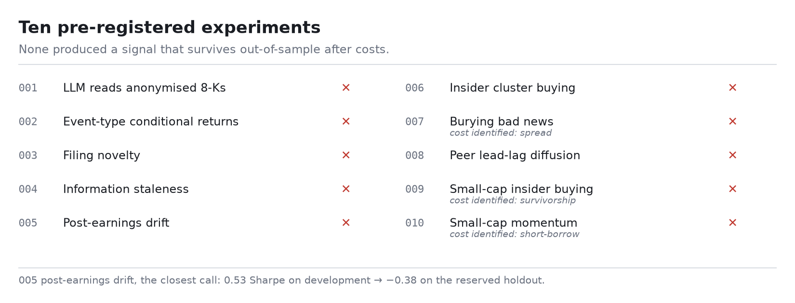

# hindsight

[](https://github.com/seanluofficial/hindsight/actions/workflows/ci.yml)
[](https://hindsight-hpunstepzzu536epfhsjwz.streamlit.app)
[](pyproject.toml)
[](LICENSE)

A **contamination-resistant research platform** for testing whether public market data carries
tradeable information — and, more importantly, for *honestly measuring* when it does not.



It began by asking whether an LLM can predict returns from an SEC 8-K it isn't allowed to
identify (the name is that thesis: the model was trained on the outcomes, so *hindsight*
contamination is the central threat). It grew into **ten pre-registered experiments** on a full
**EXPLORE → HOLDOUT → live-FORWARD** design. None produced a signal that survives out-of-sample
after costs — and the value is in *how* they fail: **two "wins" caught by the reserved holdout**,
and **three distinct real-world costs** that each kill a small-cap backtest. The deliverable is an
honest measurement, not a profitable bot.

**[Live dashboard](https://hindsight-hpunstepzzu536epfhsjwz.streamlit.app)** ·
**[`FINDINGS.md`](FINDINGS.md) — the full written narrative, start here** ·
[`experiments/`](experiments/README.md) ·
[`PREREGISTRATION.md`](PREREGISTRATION.md)

## By the numbers

| | |
|---|---|
| 8-K filings ingested | **100,559**, 2010–2024, point-in-time S&P 500 membership |
| Filings anonymized | **75,756**, zero lexical leaks |
| Insider transactions (Form 4) | **380,000+** |
| Daily price observations | **11.5M** across ~4,900 tickers, delisted names included |
| Pre-registered experiments | **10** |
| Signals that survived out-of-sample | **0** |

## Key findings

**An AI reading an anonymized 8-K is a coin flip.** Across 5,000 anonymized filings
(DeepSeek, temperature 0), directional hit rate is 49.9% / 51.2% / 49.8% at 1 / 5 / 20 days,
and the 5-day quintile long/short Sharpe is +0.14 after 10 bps — below the pre-registered
threshold, so **H1 is not supported (§14)**. It reads fluently and predicts nothing. The
Loughran-McDonald dictionary baseline is likewise negative at every horizon and cost level.

**The disguise fails 38.7% of the time.** Asked to name the issuer of an anonymized filing,
the model got it right on 58 of 150 — nearly double the 20% threshold fixed in §6 before any
code was written. It succeeds because **filings describe themselves**, and no amount of
name-redaction touches that:

| Actual | Guessed | The clue it used |
|---|---|---|
| AWK | American Water Works | "largest publicly traded U.S. water and wastewater utility, over 6,800 employees" |
| DAL | Delta Air Lines | "Atlanta airport power outage", "Trainer refinery", "profit sharing for pilots" |
| MOS | Mosaic | "phosphate and potash operations", "Vale S.A.", "TIPLAM port" |
| ORLY | O'Reilly Automotive | "leading retailer in the automotive aftermarket, 5,000+ stores" |
| AGN | Allergan | named subsidiary "Forest Laboratories, LLC" |

The anonymizer removes names, tickers, dates, addresses, executives and cities, and does it
well. But it cannot remove *self-description* without destroying the content being analysed.
**Redaction defeats string matching, not comprehension.** §6 fixed the consequence in
advance: above 20%, the primary analysis is restricted to filings the model failed to
identify, and both versions reported. **This rate is a lower bound** — quota limits forced
the audit onto a smaller model than the one used for scoring, and smaller models recognise
fewer companies.

**Confidence is uninformative.** The model is overconfident by ~0.08 (Brier 0.263) and its
reliability curve is flat: when it states 80%+ confidence it is right about half the time.

**Half the move is gone before you can trade it.** The median 8-K already has ~47% of its
abnormal move complete before the filing reaches EDGAR. Earnings 8-Ks are the stalest at
57%, and no event type is cleanly "fresh" — every class has ~38%+ gone by filing time.

## The ten experiments

| # | Question | Outcome |
|---|---|---|
| 001 | Can an AI predict the move from anonymized filing text? | Coin flip; 38.7% contamination |
| 002 | Does the type of event matter? | Near-null (p ≈ 0.4–0.8) |
| 003 | Does changed language beat boilerplate? ("Lazy Prices") | Null, and the sign is backwards |
| 004 | Was the news already old when filed? | Diagnostic: ~47% of the move already gone |
| 005 | Post-earnings drift | **0.53 Sharpe on development → −0.38 on the holdout** |
| 006 | Insider cluster buying (S&P 500) | Null — the result that motivated 009 |
| 007 | Do firms bury bad news? | Significant −24 bps, but a 0.22 Sharpe: dies on **spread** |
| 008 | Peer lead-lag diffusion | t ≈ 4 becomes a negative book after the overlap correction |
| 009 | Small-cap insider buying | **+65 bps → −122 bps holdout, −65 bps live 2025+**; **survivorship** |
| 010 | Small-cap momentum | Long/short clears the bar; the edge is all in shorts you can't **borrow** |

Full narrative and mechanisms in [`FINDINGS.md`](FINDINGS.md).

## Method

- **Pre-registration.** Each hypothesis and its pass/fail threshold is fixed in
  [`PREREGISTRATION.md`](PREREGISTRATION.md) before the answer is looked at. The
  specification is locked and wins any disagreement.
- **EXPLORE → HOLDOUT → live-FORWARD.** Development years, then reserved years touched once,
  then data that did not exist when the signal was built.
- **A multiple-testing alpha budget** across the experiment family — see
  [`PROTOCOL.md`](experiments/PROTOCOL.md).
- **Nothing is silently dropped.** Every run writes a manifest recording the git SHA,
  parameters, row counts, and every exclusion with its reason.
- **Deviations are logged, not absorbed.** [`DEVIATIONS.md`](DEVIATIONS.md) is append-only.

## Dashboard

```bash
uv run streamlit run src/hindsight/dashboard/app.py
```

Research, Track record and Today. Research leads with sample size, anonymization counts and
sample-size warnings *before* any performance figure, then calibration, then returns at every
horizon and cost level, then the full exclusion ledger.

The working database is ~95MB and the raw filing cache ~2.8GB, so neither is deployable.
`scripts/export_results.py` writes a ~700KB bundle of evaluated trades plus a summary stamped
with its git SHA, and the dashboard reads that when no database is present — both paths build
identical `Trade` objects, so figures are computed by the same code either way.

## Setup

Requires Python 3.11+ and [uv](https://docs.astral.sh/uv/).

```bash
uv sync --group dev
cp .env.example .env      # then fill in TIINGO_API_KEY
```

Two credentials matter:

| Variable | Why |
|---|---|
| `HINDSIGHT_EDGAR_CONTACT` | SEC requires a User-Agent with real contact info. Requests without one are throttled, then blocked. |
| `TIINGO_API_KEY` | Price data. Free key at [tiingo.com](https://www.tiingo.com/account/api/token). |

## Reproducing the pipeline

```bash
# Reconstruct point-in-time S&P 500 membership and freeze it to data/sp500_membership.csv
uv run python scripts/run_ingest.py universe --rebuild

# Crawl the EDGAR full index and ingest in-universe 8-Ks
uv run python scripts/run_ingest.py filings --year 2018            # whole year
uv run python scripts/run_ingest.py filings --year 2018 --quarter 1 --limit 25   # smoke test

# Daily OHLC + SPY benchmark
uv run python scripts/run_ingest.py prices --year 2018

# Row counts and coverage
uv run python scripts/run_ingest.py status
```

Every fetch is cached under `data/raw/`, so re-running never refetches and a crashed crawl
resumes where it stopped.

## Checks

```bash
uv run pytest                                    # 371 tests
uv run ruff check . && uv run ruff format --check .
uv run mypy src scripts                          # strict
```

## Limitations

- **Contamination cannot be fully removed.** The 38.7% identification rate is a measured
  lower bound, so even the null results are measured under contamination.
- **Ten experiments is a family, not a sweep.** The alpha budget accounts for the ones run;
  it cannot account for hypotheses never written down.
- **Costs are modelled, not paid.** Spread, borrow and survivorship are handled explicitly
  where they proved decisive (007, 009, 010), but a flat bps model is still a model.
- **This is not a trading system**, and no result here supports deploying capital.

## Two things worth knowing about the data

**EDGAR acceptance timestamps are Eastern, not UTC.** The archive header records
`<ACCEPTANCE-DATETIME>20180201163017` for a filing the submissions API reports as
`2018-02-01T21:30:17Z`. Reading it as UTC would shift every event five hours and move filings
across the 16:00 ET cutoff in §4 without raising anything. Ingest converts once, at the
boundary; everything downstream is UTC.

**Prices are stored raw, with `adj_close` alongside.** Returns must not mix the two — a
2-for-1 split between entry and exit would read as −50%. Use
`prices.adjustment_factor(close, adj_close)` to recover adjusted values.

## Layout

```
src/hindsight/
  config.py            # every constant a result depends on
  db.py                # five-table SQLite schema; predictions immutable by trigger
  manifest.py          # run provenance and exclusion accounting
  trading_calendar.py  # real NYSE sessions — a weekday is not a trading day
  ingest/
    http.py            # rate-limited, disk-cached fetcher
    universe.py        # point-in-time S&P 500 membership
    edgar.py           # full-index crawl, header parsing, EX-99 extraction
    prices.py          # Tiingo daily OHLC + benchmark
scripts/run_ingest.py
tests/
```

The four pipeline stages are independently runnable and communicate only through SQLite.

## Related

**Sibling project:** [Market Structure Radar](https://github.com/seanluofficial/marketradar)
([live app](https://marketradar-9m9rrx4hps5vpywf2dqfn5.streamlit.app)) continues this
programme — the same pre-registration discipline applied to correlation structure and risk
analytics, adding experiments **011** (time-series momentum) and **012** (volatility
management, low-volatility anomaly): 25 further declared cells, none surviving. Twelve
hypotheses across the two repositories; zero edges found.

The superseded 2018 pilot run is kept in [`docs/legacy-pilot.md`](docs/legacy-pilot.md).

## License

MIT — see [LICENSE](LICENSE).
